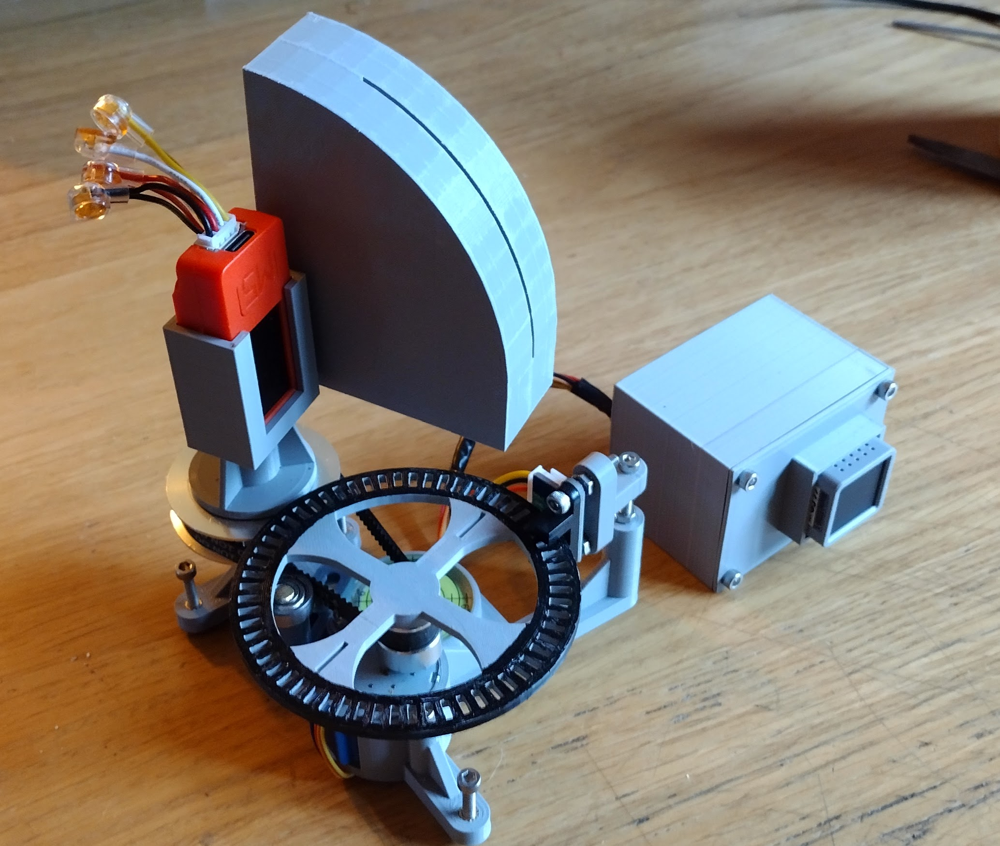
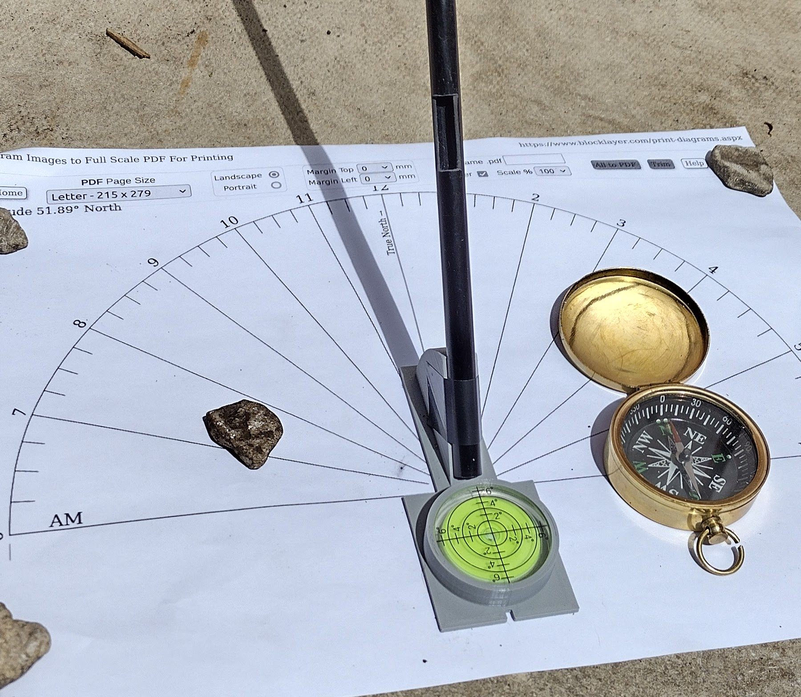
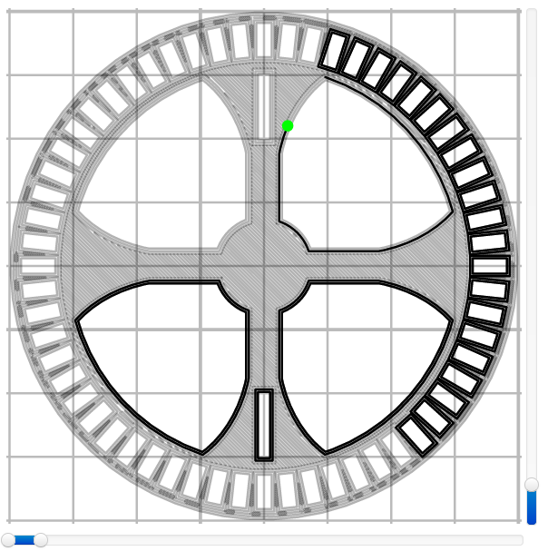
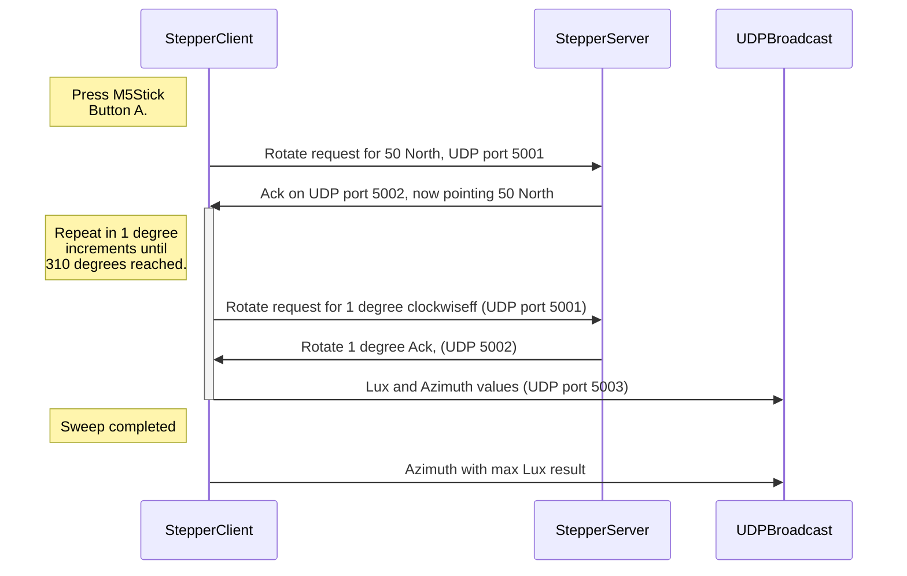

# SolarClock

 
This project shouldn't be confused with a plan to design a clock powered by solar energy. That's not what this is about. Instead, it represents an academic attempt at calculating the time based on the position of the sun in the sky.

Yes, you could look at your watch, listen for the pips on the radio or even glance at your mobile phone - but this isn't a move to try and replace those reliable sources. It's more about trying to observe the local environment and making calculations baised on what can be seen.   

I can't pretend when this is finish it will have much value - it's more of a nonsense machine bred out of boredom. Regardless, I do think it will be interesting to see how accurately time can be calculated using a bunch of cheap electronics and some 3D printed tat.
 
There will probably end up being just two main components in all of this:

- A "Stepper motor server" being driven via an M5Atom-matrix, although any esp32/Arduino type platform would do. I chose the Matrix because I had one spare and could make use of the LED array for added glitz.
- A "Stepper client" that will read light values and instruct the server how far to rotate after each reading. This component is based round an M5Stick because it's got a built in battery. This helps negate the need for trailing wires being dragged round by the rotating platform.

When I started out on this venture, I tried using an I2C based compass (LSM303) for azimuth alignment. Like any "sundial", you have to know which way is north. The LSM303 claimed a 0.1 degree resolution, but after some failed tests and a bit of reading I discovered that although the resolution is good, accuracy is +-5 degrees. Given that the earth rotates through roughly 15 degrees in an hour, It just wouldn't provide the accuracy I'm looking for. So, in the end I went back to the drawing board and came up with a timing disk design. The main drawback of this approach is you need to manually ensure the light sensing unit is facing true north whenever you press the inevitable "go" button. Not really good enough for me.

## North
Finding true north is problematic. You could use a normal magnetic compass and deal with the offset, but from what research I've done so far this looks a little vague (Magnetic north is always on the move). I'm still considering adding some form of gnomon to the rotator base so it can be aligned (after performing solar observations), but that looses the semi-instant gratification of just pushing a button I've also been considering a gyro, but that leads towards the chicken and egg situation of still not actually knowing where true north is in the first place. I've read some of the physics and I'm well aware that a gyro can achieve this because it's affected by the rotation of the earth. Such a gyro is really expensive and I don't think I'm capable of constructing one of my own. For now I'm going to carry on testing commercially availble magnetometers to see if there's something better than the LSM303. Watch this space.

<b><i>Updates:</i></b>

- 12th June 2022. Finished an evaluation of another magnetometer, the BMM150. I chose this one to test because it's actually sold as a viable and accurate compass. In my usecase, this still proved to be unreliable. I have a suspicion that even after calibration the environment is too electrically noisy. I'm currently planning to drop the idea of using any of these i2c devices, although I might change my mind at a later stage. I'm now thinking there may need to be a physically seperate component to this project in order to perform the initial allignment. 

- Going back to the drawing board again, I've since discovered that for my geographic area, the magnetic declination is currently 0.12 mins, i.e. 0.2 degrees. I don't know what the annual variation is, but I'm heading towards the more simple concept of just drawing an accurate east/west line. I'll positioning the rotating head at a right angles to this before I start. I can draw the rhumb line "offline" so there is no equipment interference and for now, just accept the accuracy of a normal bearing compass. 

- Performed some cross check tests in the back garden to correlate the whole magnetic north/true north solar time theory. I don't know why, but I'm surprised at just how accurate the results are. This gives me some confidence that I should be able to correctly calculate the time within at least a 15 min window. 
   

## The Components - Stepper motor server

- M5Atom matrix (*The Stepper motor WiFi server platform*)
- 28BYJ-48 5V stepper motor with ULN2003 driver
- Infra-red photo interrupter sensor
- Round button-type spirit level
- GT2 200 tooth belt, 20 and 60 tooth belt pulley
- 5mm brass rod
- Pulley tensioner bearing (*14mm od, 5mm id*)
- 3d M3 inserts (12)
- Assortment of M3 machine screws
- 3D printed components - as stored in the STL directory
- (Maybe a desire to wait for a day when it isn't raining and you can see the sun?)

## Stepper client

- M5Stickc (I'm using the PLUS variant)
- BH1750 light sensor (*in I2C mode*)
- Some (as yet to be decided) magnetometer

## Notes:

- This is a work in progress !!
- In the UK, the sun can rise at 50 degrees east and set at 310 west (this is it's local maximum azimuth boundary). The stepper motor client has therefore been set to only sweep between these angles, one degree (but 30 odd stepper motor half steps) at a time. In theory, this should allow for a resolution of about 2 mins, but I doubt that such accuracy is achievable.
- The HM1750 light sensor on the client has been set up so it only has a 1mm vertical view of the sky (from an elevation of 10 degrees through to 65 - the minimum and maximum throughout the year. The container box for the sensor looks odd, but there is a reason behind this. Obviously, the closer the sensor is to the apeture, the more of the sky can be seen (Think peeping through a keyhole). Given that the stepper platform is being advanced by one degree at a time, it seemed to make sense for the sensor view to be similarly restricted. I have no idea if this is the right decision, but it's only another 3d print away from being correctable!. In theory, 360mm circle circumference means a 57.3mm viewing radius - thus the odd size and shape.  
- The pulley ratio on the stepper server is 3:1 - I.E, the stepper motor has to rotate three times in order for the output pulley (the base) to rotate once. The timing disc has 60 slots in it - giving 120 pulses (60 on and 60 off) per revolution. 120 x 3 = 360. The stepper motor seems to take 40 odd half steps to clear a slot and roughly 20 to clear each space. Part of the reason for this difference is that the top edges of the space segments are narrower than the bottom. Using Tinkercad I couldn't see a way round this issue - but I don't believe it's going to matter that much. If it does become problematic the difference can be catered for in the code.  

 

 <b>The mark and space variation</b>

- The Stepper client and server communicate over WiFi using UDP. What with the M5Stick's built in battery this removes any need for wiring between the stepper base and rotator. I decided on UDP rather than TCP to reduce cpu loads. Communication re-tries are seen, but the current code seems to address this shortfall.

- As already highlighted, the apeture box face must be pointing towards true north. When the front button on the M5Stick is pressed, degree position zero is assumed. The rotate to the 50 degrees start point (after a short pause) is then initiated. After that, the "1 degree at a time" step scan for the brightest bearing takes place.

- At some stage, it could be that the HM1750 sensor will need to be vertically rotated from 10 to 65 degrees during the scan. Doing this might provide better resolution as to where the sun really is - I'll only know after doing some tests.

- [Tinkercad](https://www.tinkercad.com/things/aQJdY34zP4q) files available here if you want to modify the design

# Interim results

On the 15th June 2022 I managed to get a set of tests done. Bright sunny day with a clear sky. After manually aligning the sensor with true north (only by sight), I performed the first test at 09:23. According to the tables I'm using as a reference, at 09:20 the sun should have an azimuth of 100.79 and 09:25, 101.9. At 09:23, the sensor returned a value of 54612 for bearing 100 and 51554 for 101. All other light readings were 3 digits. The second test was run at 09:26. Again, the tables show azimuth of 101.9 at 09:25 and 103.2 at 09:30. For bearing 101 I got a value of 3613, for 102 the value was 18735 and for 103, 13504. Here, the highest bearing was 102. I'm very pleased with the results because with these short tests I seem to be well within a +/- 5 mins tolerance. That's better than I initially expected. Obviously I would have to embed some lookup table in the code, but for now I'm going to focus on trying to improve the accuracy. Again, watch this space!  
