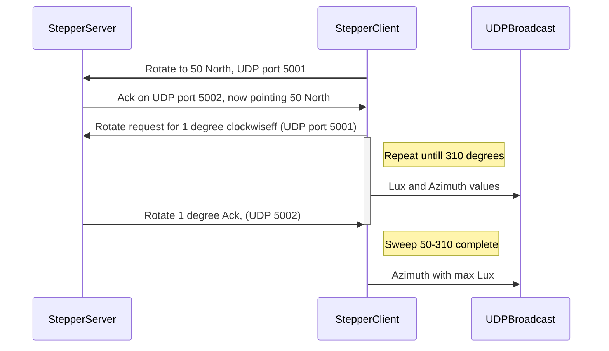

# SolarClock

Not to be confused with a clock that's powered by solar energy. That's too useful. Instead, this project represents an attempt at calculating what the time is based on the position of the sun. Yes, you could look at your watch, get the time from the Internet, listen to the radio or even look at a classic garden sun dial. That's not the point and I won't pretend this project has any value. It's more of a nonsense machine born out of boredom, but I think it will be interesting to see how accurate a time can be calculated by using a bunch of electronic hardware and 3D printed parts.
 
There will probably be two components in all of this:

- A "Stepper motor server" being driven via an M5Atom-matrix, although any esp32/Arduino type platform would work. I chose the Matrix because I had one spare and could make use of the LED array for informative visual effects.
- A "Stepper client" that will read light values and instruct the server how far to rotate after each reading. This component is based round an M5Stick because it's got a built in battery which removes the need for trailing wires on a rotating platform.

## Components - Stepper motor server

- M5Atom matrix (*The Stepper motor WiFi server platform*)
- 28BYJ-48 5V stepper motor
- Infra-red photo interrupter sensor
- Round button-type spirit level
- GT2 200 tooth belt
- GT2 20 tooth belt pulley
- GT1 60 tooth belt pulley
- 5mm brass rod
- Pulley tensioner bearing (*14mm od, 5mm id*)
- 3d M3 inserts (12)
- Assortment of M3 machine screws
- 3D printed components - as stored in the STL directory
- (Maybe A will to carry on and have a real life when it isn't raining)

## Components - Stepper client

- M5Stickc (I'm using the PLUS variant)
- BH1750 light sensor (*in I2C mode*)

## Notes:

- This is a work in progress !!
- In the UK, the sun can rise at 50 degrees east and set at 310 west (this is it's maximum Azimuth). The stepper motor server has therefore been set to only sweep between these angles, one degree (but 30 odd steps) at a time. In theory, this should allow for a resolution of 2 mins, but I doubt that is achievable.
- The HM1750 on the client has been set up so it only has a 1mm vertical view of the sky (from an elevation of 10 degrees through to 65 - the minimum and maximum throughout the year). The container box for the sensor looks odd, but there is a reason behind this. Obviously, the closer the sensor is to the apeture, the more of the sky can be seen (Think peeping through a keyhole). Given that the stepper is being advanced by one degree at a time, it seemed to make sense for the sensor view to be restricted. I have no idea if this is right!). In theory, 360mm circle circumference means 57.3mm radius - thus the size and shape.  
- The pulley ratio on the stepper server is 3:1 - I.E, the stepper motor has to rotate three times in order for the output pulley (the base) to rotate once. The timing disc has 60 slots in it - giving 120 pulses (60 on and 60 off) per revolution. 120 x 3 = 360. The stepper motor seems to take 40 odd steps to clear a slot and around 20 to clear each space. Part of the reason for this difference is that the top edges of the space segments are narrower than the bottom. Using Tinkercad I couldn't see a way round this issue - but I don't believe it's going to matter much.  
- The Stepper client and server communicate over WiFi using UDP. This removes the need for any wiring between the stepper base and rotator. I decided to use UDP in order to reduce cpu loads. Communication re-tries are seen, but the current code seems to address this shortfall.

- The apeture box face must be pointing north. When the front button on the M5Stick is pressed, degree position zero is assumed and the rotate to 50 degrees is initiated (after a short pause). The scan for the brightest bearing then takes place.  I tried using an electronic compass to get bearings, but all attempts resulted in poor accuracy readings which is why I moved back to using a timing disc.
- Now I just need to wait for a sunny day to see if it works. That could be quite a while.
- [STL files available here](https://www.tinkercad.com/things/aQJdY34zP4q)
