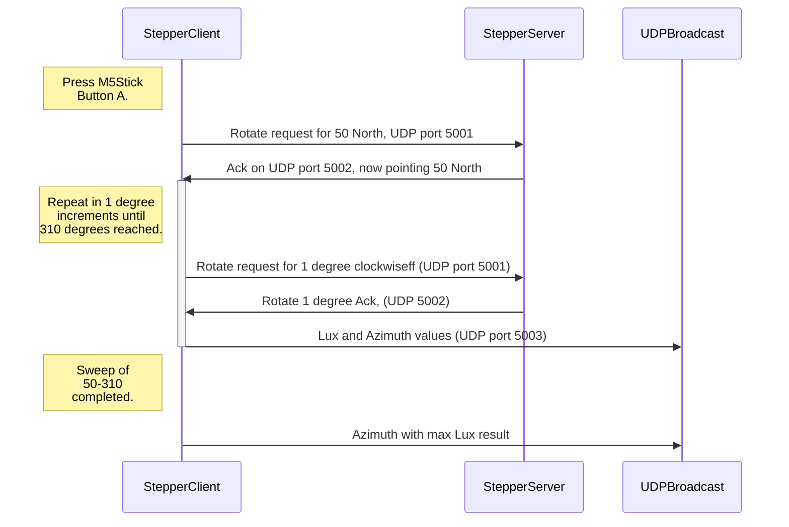

# SolarClock

This project shouldn't be confused with a plan to design a clock powered by solar energy. That would be just too useful. Instead, it represents an attempt at calculating the time based on the position of the sun in the sky. 

Yes, you could look at your watch, listen for the pips on the radio or even look at a classic garden sun dial. That's not the point. 

I can't pretend when I finish this it will have much value - it's more of a nonsense machine bred out of boredom. Regardless, I think it will be interesting to see how accurately time can be calculated using a bunch of cheap electronics and some 3D tat.
 
There will probably end up being just two components in all of this:

- A "Stepper motor server" being driven via an M5Atom-matrix, although any esp32/Arduino type platform would do. I chose the Matrix because I had one spare and could make use of the LED array for added glitz.
- A "Stepper client" that will read light values and instruct the server how far to rotate after each reading. This component is based round an M5Stick because it's got a built in battery. This helps negate the need for trailing wires being dragged round by the rotating platform.

When I started out on this venture, I tried using an I2C based compass (LSM303) for azimuth alignment. It claimed a 0.1 degree resolution, but after some failed tests and a bit of reading I discovered that although the resolution is good, accuracy is +-5 degrees. Given that the earth rotates through roughly 15 degrees in an hour, It just wouldn't provide the accuracy I'm looking for. So, in the end I went back to the drawing board and came up with a timing disk design. The main drawback of this approach is you need to ensure the light sensing unit is facing directly north whenever you press the inevitable "go" button. 

When I eventually abandon this project I'm probably going to try and design a digital compass (with moving parts) that might actually do the job.

## Components - Stepper motor server

- M5Atom matrix (*The Stepper motor WiFi server platform*)
- 28BYJ-48 5V stepper motor with ULN2003 driver
- Infra-red photo interrupter sensor
- Round button-type spirit level
- GT2 200 tooth belt, 20 and 60 tooth belt pulley
- 5mm brass rod
- Pulley tensioner bearing (*14mm od, 5mm id*)
- 3d M3 inserts (12)
- Assortment of M3 machine screws
- 3D printed components - as stored in the STL directory
- (Maybe a desire to wait for a day when it isn't raining and you can see the sun?)

## Components - Stepper client

- M5Stickc (I'm using the PLUS variant)
- BH1750 light sensor (*in I2C mode*)

## Notes:

- This is a work in progress !!
- In the UK, the sun can rise at 50 degrees east and set at 310 west (this is it's local maximum azimuth boundary). The stepper motor client has therefore been set to only sweep between these angles, one degree (but 30 odd stepper motor half steps) at a time. In theory, this should allow for a resolution of about 2 mins, but I doubt that such accuracy is achievable.
- The HM1750 light sensor on the client has been set up so it only has a 1mm vertical view of the sky (from an elevation of 10 degrees through to 65 - the minimum and maximum throughout the year). The container box for the sensor looks odd, but there is a reason behind this. Obviously, the closer the sensor is to the apeture, the more of the sky can be seen (Think peeping through a keyhole). Given that the stepper platform is being advanced by one degree at a time, it seemed to make sense for the sensor view to be similarly restricted. I have no idea if this is the right decision, but it's only another 3d print away from being correctable!. In theory, 360mm circle circumference means a 57.3mm viewing radius - thus the odd size and shape.  
- The pulley ratio on the stepper server is 3:1 - I.E, the stepper motor has to rotate three times in order for the output pulley (the base) to rotate once. The timing disc has 60 slots in it - giving 120 pulses (60 on and 60 off) per revolution. 120 x 3 = 360. The stepper motor seems to take 40 odd half steps to clear a slot and roughly 20 to clear each space. Part of the reason for this difference is that the top edges of the space segments are narrower than the bottom. Using Tinkercad I couldn't see a way round this issue - but I don't believe it's going to matter that much. If it does become problematic the difference can be catered for in the code.  
- The Stepper client and server communicate over WiFi using UDP. What with the M5Stick's built in battery this removes any need for wiring between the stepper base and rotator. I decided on UDP rather than TCP to reduce cpu loads. Communication re-tries are seen, but the current code seems to address this shortfall.

- The apeture box face must be pointing towards true north. When the front button on the M5Stick is pressed, degree position zero is assumed. The rotate to the 50 degrees start point (after a short pause) is then initiated. After that, the "1 degree at a time" step scan for the brightest bearing takes place.

- Finding true north is problematic. You could use a normal magnetic compass and deal with the offset, but from what research I've done so far this looks a little vague (Magnetic north is always on the move). I'm still considering adding some form of gnomon to the rotator base so it can be aligned (after performing solar observations), but that looses the semi-instant gratification of just pushing a button I've also been considering a gyro, but that leads towards the chicken and egg scenario of still not knowing where true north is. For now I'm going to carry on testing commercially availble magnetometers to see if there's something better than the LSM303. Watch this space.

- At some stage, it could be that the HM1750 sensor will need to be vertically rotated from 10 to 65 degrees during the scan. Doing this might provide better resolution as to where the sun really is - I'll only know after doing some tests.
- Now I just need to wait for a sunny day to see if it works. That could be quite a while.
- [Tinkercad](https://www.tinkercad.com/things/aQJdY34zP4q) files available here if you want to modify the design
